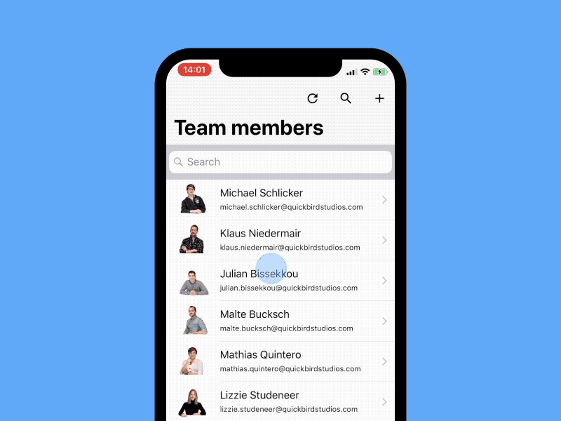

# PullToReach 👆

[](https://travis-ci.org/quickbirdstudios/PullToReach)
[](https://cocoapods.org/pods/PullToReach)
[](https://cocoapods.org/pods/PullToReach)
[](https://cocoapods.org/pods/PullToReach)

PullToReach is a simple drag-and-drop solution for implementing the pull-to-reach functionality seen in the music app [Soor](http://soor.app) by [Tanmay](https://twitter.com/tanmays).



## 🏃‍♂️ Getting started

Getting started is as easy as conforming your ViewController to the `PullToReach` protocol and activating the functionality by calling the `activatePullToReach` function.

```swift
class TeamMembersViewController: UITableViewController, PullToReach {

    override func viewDidLoad() {
        super.viewDidLoad()

        self.navigationItem.rightBarButtonItems = [
            addBarButtonItem,
            refreshBarButtonItem
        ]

        self.activatePullToReach(on: navigationItem)
    }
    
    ...
```

If your ViewController is contained in an `UINavigationController` you can activate pull-to-reach on all `UIBarButtonItems`. Selecting an item using pull-to-reach will call the same action as the normal UIBarButtonItem action so there is nothing more for you to be done.

## 🖌 Custom styling

#### Changing higlight color

If you want to change the higlight color you can just additionally specify the color when activating pull-to-reach.

```swift
self.activatePullToReach(on: navigationItem, highlightColor: .red)
```

#### Completly custom behavior

By overriding the `applyStyle` function you can define completly custom style. All the changes between states will be animated by default.

```swift
class ScalingButton: UIButton {

    override func applyStyle(isHighlighted: Bool, highlightColor: UIColor) {
        let scale: CGFloat = isHighlighted ? 1.5 : 1.0
        transform = CGAffineTransform(translationX: scale, y: scale)
    }

}
```

## 🚴‍♂️ Usage outside of NavigationBar

Pull-To-Reach can not only be activated for the navigation items, but also for every `UIControl` independent from it position or functionality. This can be very helpful if you have non-standard views with your own controls. To define your style you can override `applyStyle` as seen above.

## 🛠 Installation

#### CocoaPods

To integrate PullToReach into your Xcode project using CocoaPods, add this to your `Podfile`:

```ruby
pod 'PullToReach'
```

To run the example project, clone the repo, and run `pod install` from the Example directory first.

#### Manually

If you prefer not to use any of the dependency managers, you can integrate PullToReach into your project manually, by downloading the source code and placing the files on your project directory.  

## 👤 Author
This framework is created with ❤️ by [QuickBird Studios](https://quickbirdstudios.com).

## ❤️ Contributing

Open an issue if you need help, if you found a bug, or if you want to discuss a feature request.

Open a PR if you want to make changes to PullToReach.

## 📃 License

PullToReach is released under an MIT license. See [License.md](https://github.com/quickbirdstudios/PullToReach/blob/master/LICENSE) for more information
